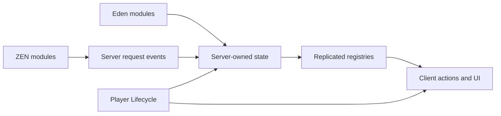

# Architecture

JM Framework is split into small CBA-style addons under `addons/`. Each component owns its configuration, prepared functions, initialization handlers and UI resources.

## Common conventions

- `XEH_PREP.hpp` prepares component functions.
- `XEH_preInit.sqf` establishes defaults and event handlers.
- `XEH_postInit.sqf` starts runtime behaviour after addons are initialized.
- Eden module functions read attributes and publish authoritative settings.
- CBA events cross machine boundaries; direct `remoteExec` is avoided.
- `jmf_core_componentStates` provides a shared status registry.

Components should remain dormant when their settings module or enable toggle is absent.
